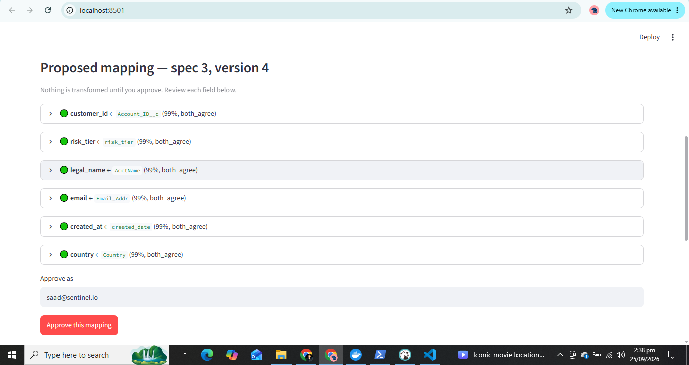
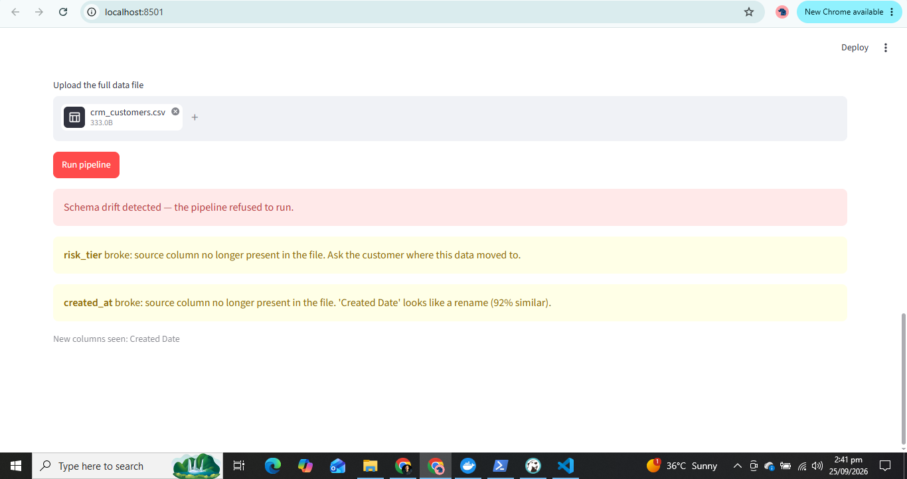
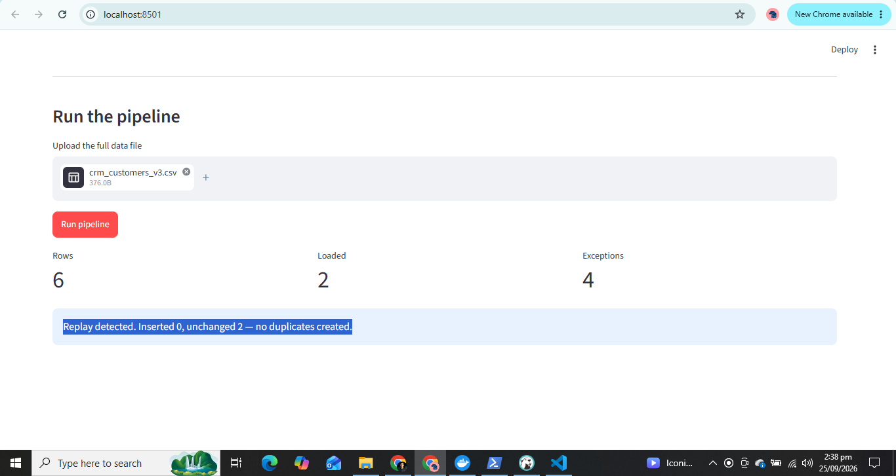

# Customer Data Onboarding & Integration Pipeline

An onboarding portal and data pipeline that takes messy customer data from CRM,
billing and support systems and maps it safely into a canonical schema — without
ever letting a model silently rewrite customer data.

Built as a Forward Deployed Engineering portfolio project.

---

## The problem

Enterprise customers rarely send clean data. Schemas don't match, customer IDs are
inconsistent across systems, dates arrive in three different formats, required
fields are missing, and the documentation is incomplete. Onboarding is where
deployment projects actually get stuck.

## What it does

1. **Ingest** a CSV and read every value as text, so leading zeros and raw formats survive.
2. **Profile** each column: types, null rates, distinct counts, detected date formats, ambiguous values.
3. **Propose a mapping** onto the canonical schema using two independent layers — fuzzy name matching plus an LLM — with a confidence score, an agreement signal, and a plain-English rationale for every field.
4. **Require human approval.** Nothing is transformed until a reviewer approves. Approval is refused if a required field is unmapped.
5. **Transform deterministically** using a fixed registry of pure functions. Ambiguous values are refused, never guessed.
6. **Validate**: types, required fields, duplicates, business rules.
7. **Quarantine failures** in an exception queue, each with a rule ID, the offending value, a reason and a suggested fix. Exceptions can be fixed (loaded as an overlay) or waived.
8. **Detect schema drift** by fingerprinting the source schema and comparing it against the approved mapping's fingerprint. Broken mappings are named exactly; likely renames are suggested.
9. **Stay idempotent**: re-running the same file creates no duplicate records.

---

## Screenshots

### Mapping review — proposals with confidence and agreement


### Schema drift — the pipeline refuses to run and says exactly what broke


### Idempotent replay — the same file twice, no duplicates


---

## Evaluation

Four source schemas of increasing difficulty, each with a hand-written
ground-truth mapping. Because the mess was generated deliberately, accuracy is
measured rather than asserted. Validation is measured using the ground-truth
mapping, so it is independent of mapping accuracy.

| Schema | Description | Heuristics only | Heuristics + LLM |
|---|---|---|---|
| S1 clean CRM | column names already canonical | 100% | 100% |
| S2 Salesforce style | `Account_ID__c`, `AcctName`, US dates, mixed country spellings | 100% | 100% |
| S3 legacy ERP | `CUST_NO`, `CO_NM`, `EML`, `DT_OPN`, numeric risk bands | 83% | 100% |
| S4 adversarial | vague names plus a decoy date column (`modified_on` vs `opened`) | 67% | 100% |
| **Mean mapping accuracy** | | **88%** | **100%** |

Validation matched the expected outcome on 100% of schemas. Confident-mapping
precision was 100% with both layers; under heuristics alone, S3 scored 0%
confident precision — it was wrong *and* not uncertain about it, which is the
failure mode the two-layer design exists to catch.

Cost of the LLM layer: 3–6 seconds per schema versus effectively zero. This is
why heuristics run first and the model is optional.

**A finding worth noting:** writing the expected outcomes by hand *before*
running the eval surfaced an ambiguous date in the S2 test data that the author
had missed. An eval that recorded whatever the pipeline produced would never
have caught it.

Run it yourself:

```bash
python eval/run_eval.py --no-llm
python eval/run_eval.py
```

---

## Mid-project change request (CR-001)

Halfway through, the customer added a requirement: *"Compliance now requires a
risk tier on every customer."*

The prediction was written before implementing (see `docs/adr/003`), then checked
against `git diff --stat`. Files changed:

- `pipeline/canonical.py` — the field definition
- `pipeline/transforms.py` — an enum normalizer
- `pipeline/db.py` + a migration — the column

**Unchanged:** the profiler, mapper, runner, validation engine, loader, drift
detector and the API. The proposer discovered the new column on its own, the
approval guard enforced it as required, and validation picked the requirement up
from the schema.

The engine is driven by data, not code: transforms come from a registry,
validation rules read `required` from the schema, and mappings are versioned
specs. Adding a field is therefore configuration, not surgery.

---

## Architecture

```
Portal (Streamlit)  →  FastAPI  →  Postgres
                          │
   Profiler → Mapping proposer (heuristics + LLM) → Mapping registry (versioned)
                                                          ↓
                          Drift detector ← fingerprints   Transform engine (deterministic)
                                                          ↓
                                                   Validation engine
                                                   ↙            ↘
                                        canonical store    exception queue
```

**Key principle: the model proposes, humans approve, code executes.** The LLM sees
only column names, statistics and *masked* sample values (`o***@acme.com`), never
full records. It cannot transform a value, write to the store, resolve an
exception, or introduce a transform function. If the API is unavailable or a
customer forbids external calls, the system falls back to heuristics and keeps
working.

Design decisions are recorded in `docs/adr/`.

---

## Running it

```bash
git clone https://github.com/Saad7896/onboarding-pipeline
cd onboarding-pipeline
cp .env.example .env    # add your ANTHROPIC_API_KEY (optional)
docker compose up --build
```

- Portal: http://localhost:8501
- API docs: http://localhost:8000/docs

Without an API key the pipeline runs on heuristics alone.

## API

| Endpoint | Purpose |
|---|---|
| `POST /upload` | Profile a file without mapping it |
| `POST /mappings/propose` | Profile and propose a mapping (saved as version N) |
| `POST /mappings/{id}/approve` | Approve, with optional per-field overrides |
| `GET /mappings/{id}/versions` | Full version history with diffs |
| `POST /pipeline/{id}/check-drift` | Compare a file against the approved mapping |
| `POST /pipeline/{id}/run` | Transform, validate, load (409 on drift) |
| `GET /exceptions` | The exception queue, filterable by status |
| `POST /exceptions/{id}/resolve` | Fix (with a corrected value) or waive |

## Stack

Python 3.12 · FastAPI ·  ComposePostgreSQL · SQLAlchemy · pandas · rapidfuzz ·
Claude (Opus 5) · Streamlit · Docker

## Known gaps

Schema migrations are applied manually rather than through Alembic. The API has
no authentication. Only CSV ingestion is implemented; the mock API connector is
designed but not built. Metrics and alerting are not wired to a monitoring stack.

The highest-value next change is a `date_order` option on the mapping spec:
confirmed once with the customer at onboarding, it would resolve an entire
ambiguous date column deterministically instead of rejecting row by row.

## Author

Saad — [GitHub](https://github.com/Saad7896)